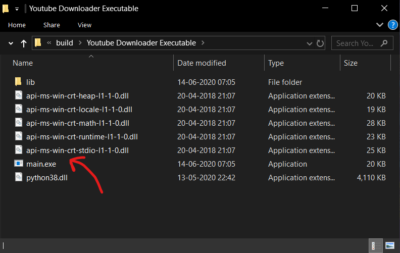
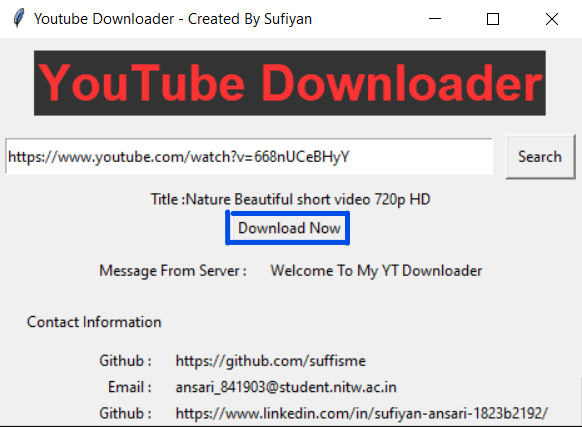
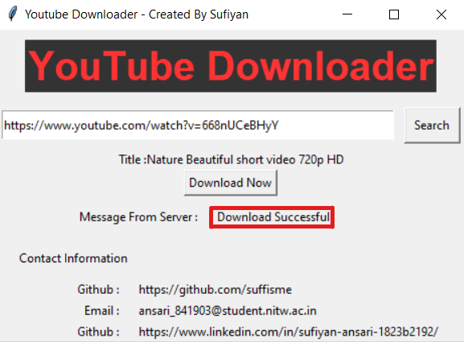
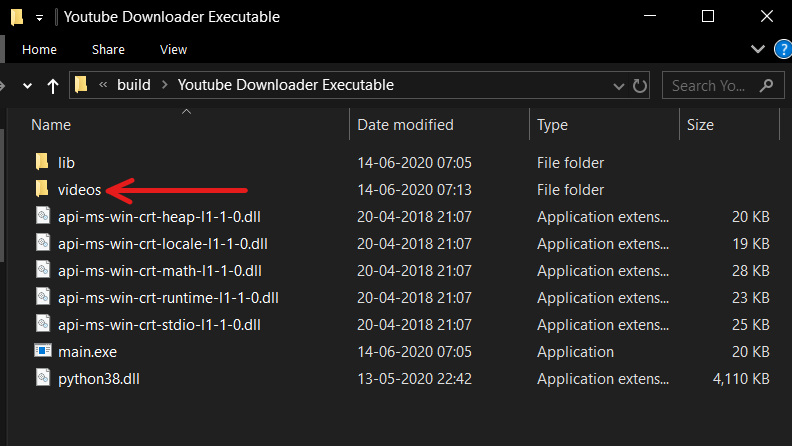
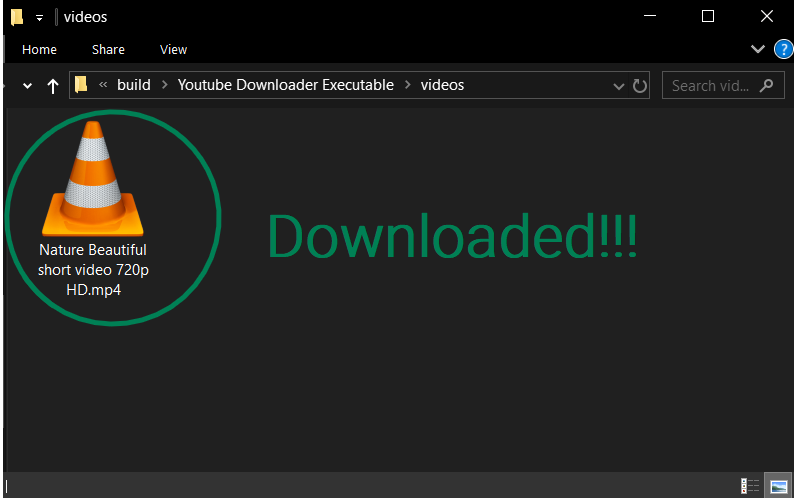

# Youtube Downloader

### An application for downloading youtube videos
### Build using python
#### Libraries Used
- pytube
- tkinter
- win32clipboard

##### Source Code will be available soon...

### Running File
- Download the ```.zip``` file from [Here](https://github.com/suffisme/YoutubeDownloader/archive/master.zip)
- Unpack it
- Open the **Youtube Downloader Executable** folder
- Run ***main.exe*** file

Note : Do not alterany path or change any name of files/folder

### Functioning
- Open ```main.exe``` file

- It will open window like this, Enter your URL in search box and click **Search**. If video exists it will show like this

- Now Click on **Download** Button. It will take some time depending upon the size of video file.

- Now go back to **Youtube Downloader Executable** folder, you'll find a new folder named ***videos*** as shown here.

- Inside ***videos*** folder, you'll find your downloaded video.


Note : During searching and downloading, because of low network strength, window title might show **Not Responding** label. No need to panic, download/search won't interrupt and as soon as your search completes or video downloads, **Not Responding** label will be gone too.

### Limitations
- It might not work on some videos not having 720p mp4 as file format.
- It doesn't have download bar.

### Future Versions
- List of Supported formats
- Better GUI
- [more to be added]